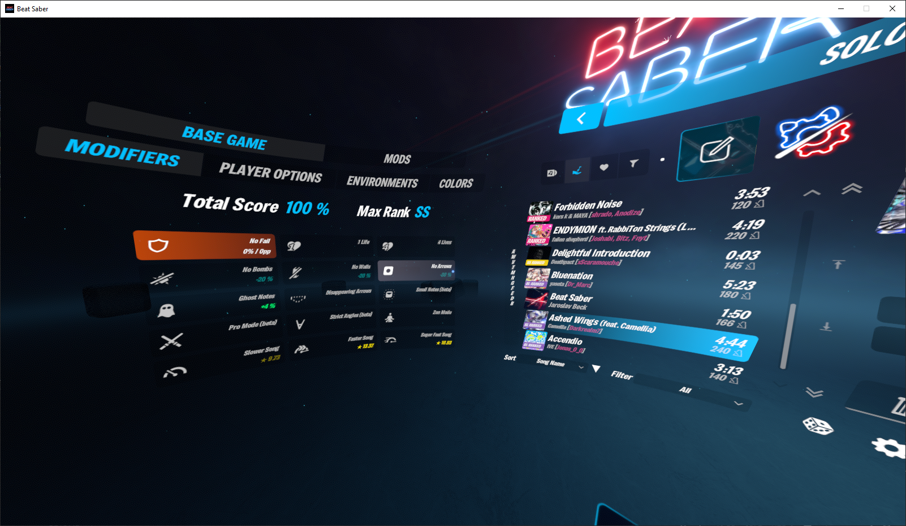

# FontChanger
This Beat Saber mod changes any uses of the Teko font in TextMeshPro and CurvedTextMeshPro components to a different user-defined font. 

This is still a heavy WIP, but the core stuff works (yippee)!



## Configuration
In your `Beat Saber/UserData` folder, drag any TrueType (`.ttf`) font into the `FontChanger/Fonts` folder, then modify the generated `FontChanger.json` file to your liking.
```json
{
  "FontName": "Freeman",
  "FontItalic": true,
  "FontSizeMultiplier": 0.77,
  "CharSpacing": -1.5,
  "WordSpacingAdjustment": 2.5
}
```
`string` **FontName**
> Filename *(without extension)* of the font you wish to replace Teko with.

`boolean` **FontItalic**
> `true` to allow already italicized text elements to remain italicized, `false` to forcibly remove italics from everything.

`float` **FontSizeMultiplier**
> Scales the font size against the set default of the text element. `1.0` to use the default font size.

`float` **CharSpacing**
> Increases or reduces the amount of padding between characters. Positive values increase it, negative values decrease it.

`float` **WordSpacingAdjustment**
> Increases or reduces the amount of padding between words. Positive values increase it, negative values decrease it.

## Known Issues
Some `CurvedTextMeshPro` elements have nested components, which seems to... prevent? the font size scaling? from working? idk. I'll figure this out eventually.

## Dependencies
- BSIPA
- BeatSaberMarkupLanguage
- SiraUtil

## Credits/Reference Mods
Still new to modding and I'm learning by looking at what others are doing, and breaking a lot (a lot) of things
- [CustomMenuText](https://github.com/Saeraphinx/CustomMenuText/tree/master)
- [Enhancements](https://github.com/Auros/Enhancements)